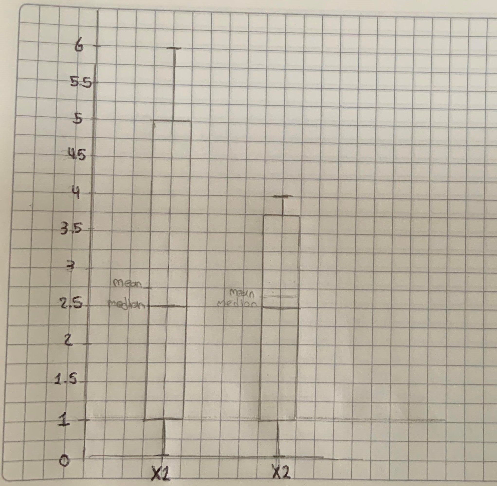
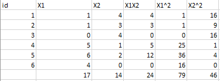

## Solución tarea 1

### 1.1 ¿Cuál es la media, mediana y desviación estándar?, y la moda y los valores repeticiones de la moda para los datos categóricos.
Media:
- X1    2.833333
- X2    2.333333

Mediana:

- X1    2.5
- X2    2.5

Moda:

- X1    1 
- X2    4

Desviación estándar

- X1    2.483277
- X2    1.632993

### 1.2 Dibujar un boxplot a mano. Utilizando los datos de la tabla 1.

### 1.3 Cual es la covarianza entre las 2 variables X1, X2

| |X1|x2|
|---|---|---|
|X1|6.166667|-3.133333|
|X2|-3.133333|2.666667|

### Cuál es la correlación entre la variable x1 y x2 (Calcularla a mano)
para calcular la correlacion entre 2 variables, podemos seguir este orden:
- calcular los datos que nos interesan como $X1*X2, X1^{2}, X2^{2}$ y la sumatoria de estos:

- Luego calculamos el promedio de cada varible de la siguiente manera, $\bar{x} = \frac{\sum x}{n}$ :

|X1|x2|
|---|---|
|2.833|2.33|

- Con esto calculamos la covarianza, $cov = \frac{\sum X*Y}{n} - \bar{x}*\bar{y}$  :

cov = -2.611

- Continuamos con la desviacion estandart $dev = \sqrt{\frac{x^{2}}{n}- \bar{x}^2}$ 

|X1|x2|
|---|---|
|2.2669|1.4969|

- Para finalmente aplicar la formula de la correlacion, $corr = \freac{cov}{devX*devY}$

corr = -0.769

### 1.5. Explica la relación entre covarianza y correlación.
La covarianza se entiende como el valor que relaciona el comportamiento de una variable cuando otra cambia. Por su parte, la correlación describe el comportamiento de dos variables cuando ambas cambian. Para nuestro ejemplo, tenemos una covarianza y correlación negativa, indicando que las variables son inversamente proporcionales y guardan una estrecha relación de dependencia.

### 1.6. Calcule el resultado del algoritmo K-means sobre este set de datos. Vamos a crear 2 grupos, es decir, k=2 (2 clusters).
