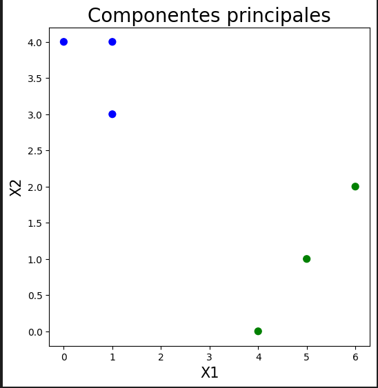

## Solución tarea 1

### 1.1 ¿Cuál es la media, mediana y desviación estándar?, y la moda y los valores repeticiones de la moda para los datos categóricos.
Media:

- para calcular la media podemos utilizar la siguiente formula:  $m = \frac{\sum x}{n}$

$X1 = \frac{17}{6}$

$X1 = \frac{14}{6}$

|X1|x2|
|---|---|
|2.833333|2.333333|

Mediana:

- La me diana es el dato que divide la muestra justo a la mitad cuando se ordena de menor a mayor. Para nuestro caso, dado que la cantidad de datos es par, lo que hacemos es sumar los datos de la mitad y dividirlos por dos de la siguiente manera.

$X1 = \frac{1+4}{2}$

$X1 = \frac{2+3}{2}$

|X1|x2|
|---|---|
|2.5|2.5|

Moda:

- La moda es el dato que mas se repite, este lo podemos sacar simplemente mirando los datos.

|X1|x2|
|---|---|
|1|4|

Desviación estándar:

- la desviacion estandart se calcula con la siguiente formula: $dev = \sqrt{\frac{x^{2}}{n}- \bar{x}^2}$ 

|X1|x2|
|---|---|
|2.2669|1.4969|

### 1.2 Dibujar un boxplot a mano. Utilizando los datos de la tabla 1.

### 1.3 Cual es la covarianza entre las 2 variables X1, X2

- La covarianza se calcual con la siguiente formula:  $cov=\frac{\sum xy}{n}-\bar{x}\bar{y}$  

cov = -2.611

### Cuál es la correlación entre la variable x1 y x2 (Calcularla a mano)
para calcular la correlacion entre 2 variables, podemos seguir este orden:
- calcular los datos que nos interesan como $X1*X2, X1^{2}, X2^{2}$ y la sumatoria de estos:

- Calculamos el promedio de cada varible de la siguiente manera, $\bar{x} = \frac{\sum x}{n}$ :

|X1|x2|
|---|---|
|2.833|2.33|

- Y utilizando los datos de la covarianza y la desviacion estandart calculados anteriormente, Para finalmente aplicar la formula de la correlacion, $corr = \frac{cov}{devX*devY}$

corr = -0.769

### 1.5. Explica la relación entre covarianza y correlación.
La covarianza se entiende como el valor que relaciona el comportamiento de una variable cuando otra cambia. Por su parte, la correlación describe el comportamiento de dos variables cuando ambas cambian. Para nuestro ejemplo, tenemos una covarianza y correlación negativa, indicando que las variables son inversamente proporcionales y guardan una estrecha relación de dependencia.

### 1.6. Calcule el resultado del algoritmo K-means sobre este set de datos. Vamos a crear 2 grupos, es decir, k=2 (2 clusters).

